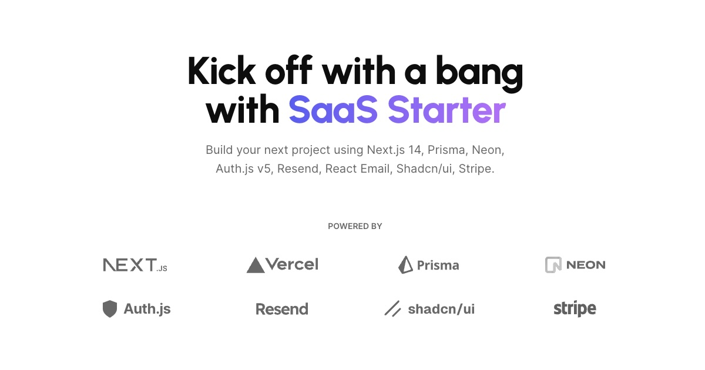

<a href="https://github.com/onurkanbakirci/rsl-editor">
  
  <h1 align="center">RSL Editor</h1>
</a>

<p align="center">
  The open content licensing standard for the AI-first Internet
</p>

<p align="center">
  <a href="https://twitter.com/onurkanbakirci">
    
  </a>
  <a href="https://github.com/onurkanbakirci/rsl-editor">
    
  </a>
  
</p>

<p align="center">
  <a href="https://app.netlify.com/projects/rsl-editor/deploys">
    
  </a>
</p>

<p align="center">
  <a href="#introduction"><strong>Introduction</strong></a> ·
  <a href="#features"><strong>Features</strong></a> ·
  <a href="#usage"><strong>Usage</strong></a> ·
  <a href="#contributing"><strong>Contributing</strong></a> ·
  <a href="#license"><strong>License</strong></a>
</p>
<br/>

## Introduction

**RSL Editor** is an open-source web application for creating and managing **Really Simple Licensing (RSL)** - a standardized, machine-readable format for content licensing in the AI era. 

RSL provides a clear, consistent way to define content usage rights, permissions, and restrictions, making it easy for content creators, publishers, and AI systems to understand and respect licensing terms.

### What is Really Simple Licensing (RSL)?

RSL is an open standard designed to address the challenges of content licensing in an AI-first world. It provides:

- **Standardized Format**: Machine-readable XML format for consistent licensing across platforms
- **AI-Ready**: Purpose-built for AI training and content consumption use cases
- **Flexible Permissions**: Support for various licensing models from open to restrictive
- **Clear Rights Management**: Define what can and cannot be done with your content

## Features

### 🚀 Core Features

- **Visual RSL Editor**: Intuitive interface for creating and editing RSL licenses
- **Website Crawling**: Automatically discover and analyze web content for licensing
- **Multi-Page Support**: Manage licenses for multiple pages and content types
- **License Templates**: Pre-built templates for common licensing scenarios
- **XML Generation**: Generate valid RSL XML from visual forms
- **Real-time Preview**: See your RSL markup as you build it

### 📊 Content Management

- **Dashboard**: Overview of all your RSL configurations
- **Project Organization**: Group related content and licenses
- **Version Control**: Track changes and updates to your licensing
- **Export/Import**: Share and backup your RSL configurations

### 🔧 Technical Features

- **User Authentication**: Secure login with NextAuth.js
- **Database Storage**: Persistent storage with Prisma and PostgreSQL
- **Modern UI**: Beautiful interface built with Tailwind CSS and Shadcn/ui
- **Responsive Design**: Works perfectly on desktop and mobile devices
- **API Access**: RESTful API for programmatic integration


## Usage

### Creating Your First RSL License

1. **Sign up** for an account or log in
2. **Navigate** to the Dashboard
3. **Click** "Create New RSL" 
4. **Enter** a website URL to analyze
5. **Configure** licensing terms using the visual editor
6. **Generate** and download your RSL XML

### RSL Format Example

```xml
<?xml version="1.0" encoding="UTF-8"?>
<rsl version="1.0">
  <content>
    <title>My Blog Post</title>
    <description>An article about AI and content licensing</description>
    <url>https://myblog.com/ai-licensing-post</url>
  </content>
  <licenses>
    <license id="license-1" name="Non-Commercial Use">
      <permits>
        <usage>read</usage>
        <usage>share</usage>
        <user>individual</user>
      </permits>
      <prohibits>
        <usage>commercial</usage>
        <usage>ai-training</usage>
      </prohibits>
      <payment type="free" />
    </license>
  </licenses>
</rsl>
```


## Author

Created by [@onurkanbakirci](https://twitter.com/onurkanbakirci) in 2025, released under the [MIT license](https://github.com/onurkanbakirci/rsl-editor/blob/main/LICENSE.md).